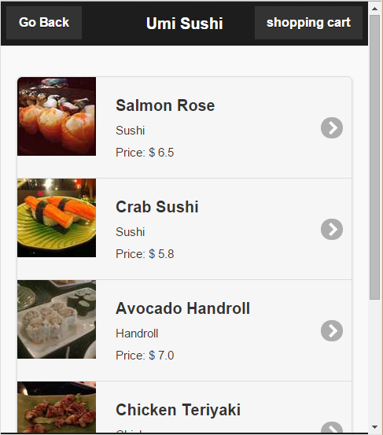
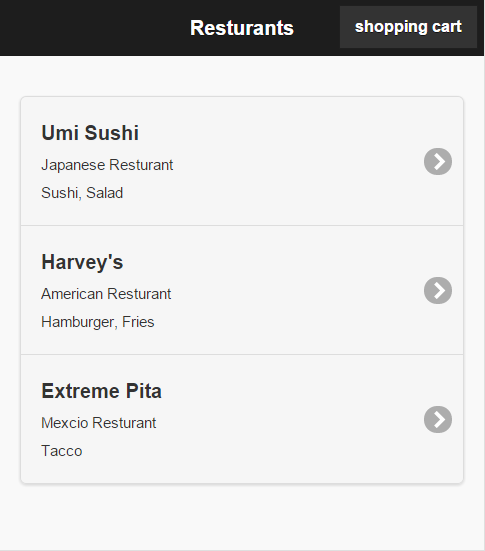

# CMPT350_course_project
A cmpt350 course project (GoOrder)

### Keys of this project

* Built web base software for easier ordering food purpose
* Developed web socket servlet in tomcat with Java
* Coded in HTML, Jsp, Javascript and Jquery mobile for client side webpage
* Designed JSON form for transferring data between clients webpage and remote database
* Used NetBeans IDE during development processing
* Done with Yang Zeng and Sam Ruo in 2014

### Screen Shot

